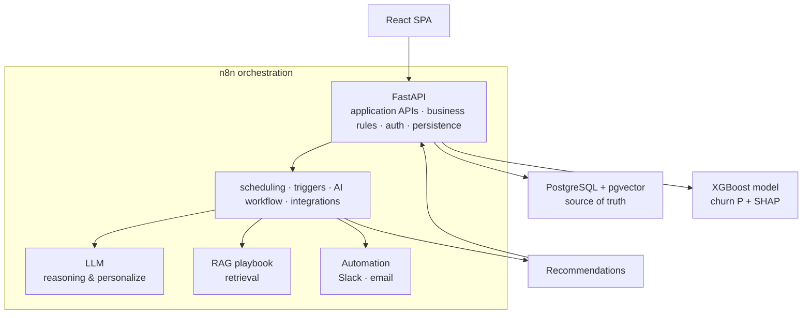
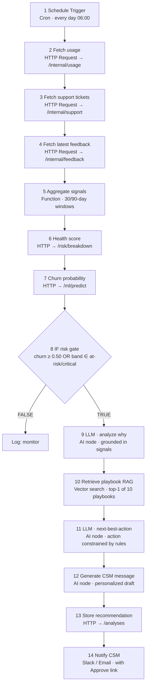
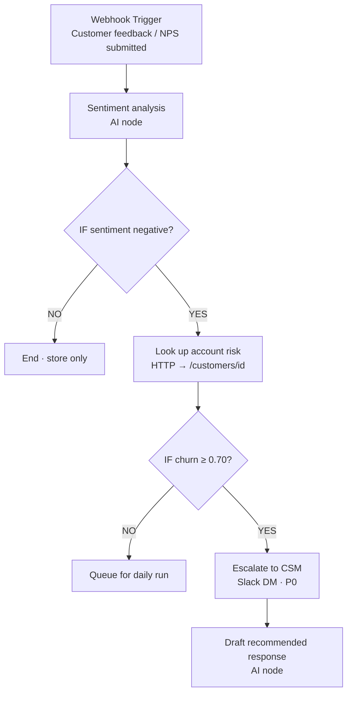
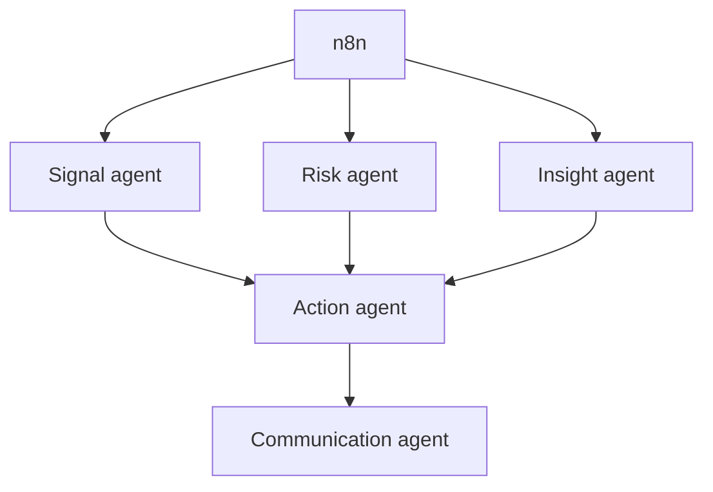

# Roadmap: n8n Automation Blueprint

This document outlines the end-to-end implementation plan for transitioning the Churn Risk Agent into a fully automated, event-driven Customer Success system orchestrated by n8n.

Everything in this blueprint runs today as an in-process Python pipeline (`orchestrator.py`). n8n adds scheduling, event triggers, retries, integrations (Slack / email / CRM), and a visual operations canvas — without moving business logic out of the backend.

## 1. Architecture

## 2. Daily Workflow

## 3. Event-driven

## 4. Agent Brain

## 5. Who does what

| Component | Responsibility |
| :--- | :--- |
| **React** | User experience |
| **FastAPI** | Application APIs, business rules, persistence, auth |
| **PostgreSQL** | Source of truth (+ pgvector for playbook embeddings) |
| **XGBoost** | Churn probability & feature attribution (SHAP) |
| **n8n** | Orchestration, schedules, event triggers, AI workflow, external integrations, retries, observability |
| **LLM (Gemini)** | Reasoning, root-cause explanation, message personalization |

**n8n anti-patterns we avoid:** Not doing: health-score math across 15 nodes · React calling n8n for every click · 10 LLM calls where 2 suffice.

## 6. Live vs roadmap

| LIVE IN THIS BUILD | WITH n8n (production) |
| :--- | :--- |
| `orchestrator.analyze_customer()` | Same steps as a visual n8n workflow |
| runs on the Analyze click | Scheduled nightly for all accounts |
| Rule engine + XGBoost + RAG + LLM | unchanged (called via HTTP nodes) |
| SQLite | PostgreSQL + pgvector |
| In-memory cosine over 10 playbooks | pgvector similarity search |
| CSM approves in the UI | + Slack/email notify with deep link |
| Manual re-analyze | Event triggers (negative feedback, payment failure, usage cliff) |
| — | Retries, dead-letter, run history, outcome logging & feedback loop |
